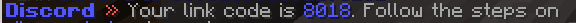

# 🎮 Play & Sync Account

## <mark style="color:purple;">Join the Server (Java)</mark>

1. Launch the <mark style="color:purple;">1.21.3</mark> version of Minecraft
2. Click Add Server in the Multiplayer Menu
3. Enter the server details:\
   \-  Server Name: <mark style="color:purple;">Corrupted Lands</mark> \
   \-  Server Address: <mark style="color:purple;">mc.corruptedlands.com</mark>\
   \- Server Resource Pack: <mark style="color:purple;">Enabled</mark>

<figure><figcaption>
Multiplier Servers
</figcaption></figure>

4. Connect to the server. Once connected, the resource pack will automatically load, and you'll be ready to explore the <mark style="color:purple;">Corrupted Lands!</mark>

<figure><figcaption>
Corrupted Lands
</figcaption></figure>

Unfortunately, we do not support the Bedrock version of Minecraft or older Java versions. Please ensure you're using the Java version mentioned above to join our server.

## <mark style="color:purple;">Synchronization Guide</mark>

1. Execute the <mark style="color:purple;">/discord</mark> command in-game and a gui will open.
2. Select the <mark style="color:purple;">Verify Account</mark> item, and it will grand you a unique 4 digit code.

<figure><figcaption>
4 Digit Code
</figcaption></figure>

3. Send this 4 digit code to the <mark style="color:purple;">@Corrupted Lands</mark> discord bot

<figure><figcaption>
Send the bot as a message to the bot
</figcaption></figure>

4. If you receive a message from the bot confirming the synchronization is complete, you'll be granted the linked role and all your in-game roles on Discord. Additionally, synchronization provides the following perks:\
   &#x20;  \- **Channel:** Access to type in the server's chat on discord\
   &#x20;  \- **Chatcolor:** Access a custom chat color inspired by the color of Wumpus!\
   &#x20;  \- **Daily Rewards:** Access to claim additional daily rewards when you complete all your 4 daily ones.
