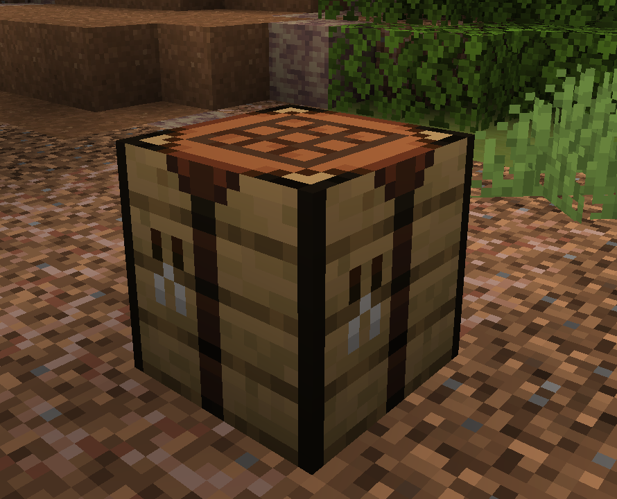

# 🔨 Workbench

## <mark style="color:purple;">Information:</mark>

The workbench makes crafting easier than the regular crafting table. Just keep the needed items in your inventory, and the system will handle the recipe for you automatically.

\[image of item]

| Category        | Information                       |
| --------------- | --------------------------------- |
| Wooden Blocks   | All the wooden blocks and items   |
| Building Blocks | All the normal building blocks    |
| Valuable Blocks | All the valuable blocks           |
| Colored Blocks  | Any block that has color variants |
| Others          | Any other workbench recipe        |

## <mark style="color:purple;">Obtain:</mark>

The workbench is unlocked by default for all users. You can get it in three ways: interact with Xavier for the first time, create your own island (it’s in the chest), or use <mark style="color:purple;">/kit starter</mark>

<figure><figcaption>
Workbench In-Game
</figcaption></figure>
